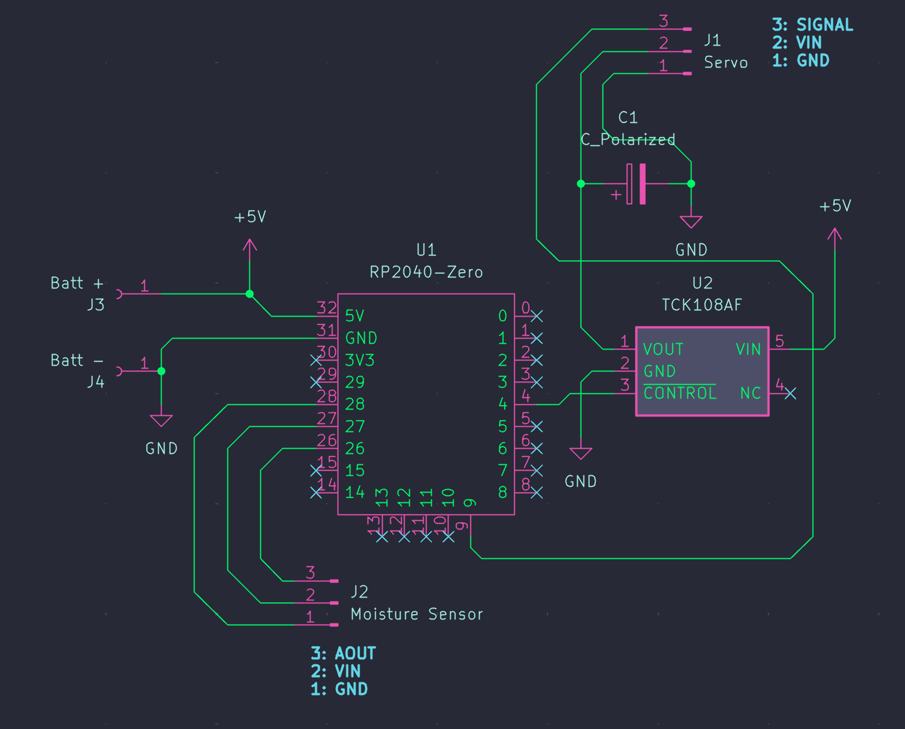
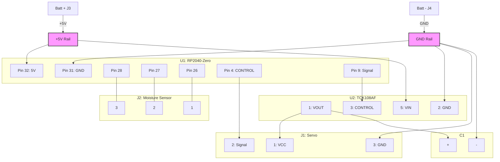

# 土壌水分センシングロボット（弱いロボット）

RP2040-Zeroを用いた土壌水分センシングロボットのリポジトリです。  
このロボットは、土壌の水分量に応じて表情を変化させることで、人間に対して自然な「助け合い」の動機付けを生み出す「弱いロボット」として設計されています。水分センサーの読み取り、状態に応じた表情制御、およびハードウェア構成に関するソースコードを管理しています。

---

## パーツリスト

| パーツ | 型番 | 入手先 | 単価 |
|---|---|---|---|
| マイコン | RP2040-Zero | - | - |
| 静電容量式土壌水分センサー | ノーブランド | - | - |
| サーボモータ | SG90S | [秋月電子 108761](https://akizukidenshi.com/catalog/g/g108761/) | ¥650 |
| ロードスイッチ | TCK108AF | [秋月電子 116073](https://akizukidenshi.com/catalog/g/g116073/) | ¥150 |
| セラミックコンデンサ | 100μF | - | - |
| (*オプション) 圧電スピーカ | PKM13EPYH4000-A0 | [秋月電子 104118](https://akizukidenshi.com/catalog/g/g104118/) | ¥30 |

---

## 回路図



designed by [Atsuyuki](https://www.instagram.com/aaa_tu)

### 回路の概要

バッテリーから電源を供給し、RP2040-Zeroで水分センサーの値を読み取り、TCK108AF（ロードスイッチ）を介してサーボモーターの電源を制御する構成

| コンポーネント | ピン名称 | 接続先 | 備考 |
| --- | --- | --- | --- |
| **バッテリー (J3)** | 1 (+V) | RP2040-Zero (32ピン: 5V) | 電源供給 |
| **バッテリー (J4)** | 1 (GND) | RP2040-Zero (31ピン: GND) | グランド |
| **RP2040-Zero** | 28ピン | Moisture Sensor (3ピン) | - |
| **RP2040-Zero** | 27ピン | Moisture Sensor (2ピン) | - |
| **RP2040-Zero** | 26ピン | Moisture Sensor (1ピン) | - |
| **RP2040-Zero** | 4ピン | TCK108AF (3ピン: CONTROL) | 電源ON/OFF制御 |
| **TCK108AF** | 1ピン (VOUT) | Servo (1ピン) | サーボ電源出力 |
| **TCK108AF** | 2ピン (GND) | RP2040-Zero (31ピン: GND) | グランド|
| **TCK108AF** | 5ピン (VIN) | +5V (バッテリー側) | 電源供給 |
| **Servo** | 2ピン | RP2040-Zero (9ピン: PWM) | 信号線 |
| **Servo** | 3ピン | RP2040-Zero (31ピン: GND) | グランド |
| **C1 (コンデンサ)** | + | TCK108AF (1ピン: VOUT) | 平滑用 |
| **C1 (コンデンサ)** | - | GND | - |



* **RP2040-Zero**: システムの中枢です。
* **水分センサー (Moisture Sensor)**: 26, 27, 28ピンを使用してデータを取得しています。
* **サーボモーター制御**:
* TCK108AFはロードスイッチ（パワーゲート）です。RP2040-Zeroの4ピン（CONTROL）から信号を送ることで、サーボモーターへの電源供給をオンオフする仕組みになっています。サーボモーターのPWM信号はRP2040-Zeroの9ピンから送ります。
* これにより、必要な時だけサーボを動かす省電力設計が可能です。
* **電源**: J3/J4から入力された5VがそのままRP2040-Zeroに供給され、そこから分岐してTCK108AFのVIN（5ピン）に入っています。

---

## ディレクトリ構成

```text
rp2040-zero/
├── README.md
├── docs/
│   └── spec.md
└── src/
    ├── code.py
    └── lib/
        ├── __init__.py
        ├── load_switch.py
        ├── moisture_sensor.py
        ├── piezo_speaker.py
        └── servo_controller.py
```

### ファイルの役割

| パス | 役割 |
| --- | --- |
| `docs/spec.md` | 実装要件の整理 |
| `src/code.py` | Thonny から実行する CircuitPython のメインスクリプト |
| `src/lib/load_switch.py` | TCK108AF の制御ライブラリ |
| `src/lib/moisture_sensor.py` | 水分センサーのアナログ値取得とキャリブレーション |
| `src/lib/servo_controller.py` | PWM によるサーボ角度制御 |
| `src/lib/piezo_speaker.py` | 圧電スピーカーの効果音再生 |

---

## ライブラリ説明

### `load_switch.py`

ロードスイッチ TCK108AF の CONTROL ピンをデジタル出力で制御します。サーボを動かす瞬間だけ電源を供給し、待機中はオフにするために使います。

* `LoadSwitch(pin, active_high=True, initial_on=False)`
* `on()` で電源オン
* `off()` で電源オフ
* `set(on)` で任意状態に設定

### `servo_controller.py`

50Hz PWM を使ってサーボ角度を制御します。角度は 0-180 度の範囲で扱い、内部でパルス幅に変換します。

* `ServoController(pin, min_angle=0, max_angle=180, min_pulse_us=500, max_pulse_us=2400)`
* `set_angle(angle, settle_sec=0.25)` で指定角度へ移動
* `off()` で PWM 出力を停止

### `moisture_sensor.py`

水分センサーのアナログ値を読み取り、電圧値と水分率に変換します。乾燥時と湿潤時の ADC 値を持たせているため、後からキャリブレーション可能です。

* `MoistureSensor(analog_pin, dry_raw=52000, wet_raw=20000, vref=3.3)`
* `read_raw()` で ADC 生値を取得
* `read_voltage()` で電圧値を取得
* `read_percent()` で 0-100% に正規化した水分率を取得
* `set_calibration(dry_raw=None, wet_raw=None)` で校正値を更新

### `piezo_speaker.py`

圧電スピーカーが実装された場合に、状態変化に応じた効果音を鳴らします。未搭載の場合は `src/code.py` で無効化できます。

* `PiezoSpeaker(pin)`
* `tone(frequency_hz, duration_sec=0.1, duty_cycle=32768)`
* `play_dry_effect()`
* `play_wet_effect()`
* `play_humid_effect()`

---

## メインロジック仕様

`src/code.py` は Thonny 上でそのまま実行するメインスクリプトです。一定時間ごとにセンサー値を読み取り、土壌状態を判定し、状態が変わった時だけサーボを動かします。

### 制御フロー

1. 各ライブラリを初期化する
2. 水分センサーの値を一定間隔で読む
3. 水分率から `dry` / `moist` / `wet` を判定する
4. 状態が前回から変化していたらロードスイッチをオンにする
5. サーボを状態に対応した角度へ動かす
6. サーボ移動後にロードスイッチをオフにする
7. スピーカーが有効なら状態に応じた音を鳴らす
8. 次の読み取りまで待機する

### 主な設定変数

| 変数名 | 初期値 | 説明 |
| --- | --- | --- |
| `SERVO_SIGNAL_PIN` | `board.GP9` | サーボ信号線の接続先 |
| `LOAD_SWITCH_PIN` | `board.GP4` | TCK108AF の CONTROL ピン |
| `MOISTURE_ANALOG_PIN` | `board.GP26` | 水分センサーのアナログ入力 |
| `SPEAKER_PIN` | `None` | 圧電スピーカーのピン。未実装時は `None` |
| `DRY_RAW` | `52000` | 乾燥状態として扱う ADC 生値 |
| `WET_RAW` | `20000` | 湿潤状態として扱う ADC 生値 |
| `DRY_THRESHOLD` | `35.0` | 乾燥判定の閾値 [%] |
| `WET_THRESHOLD` | `70.0` | 湿潤判定の閾値 [%] |
| `ANGLE_DRY` | `150` | 乾燥時のサーボ角度 |
| `ANGLE_MOIST` | `90` | 中間状態のサーボ角度 |
| `ANGLE_WET` | `30` | 湿潤時のサーボ角度 |
| `READ_INTERVAL_SEC` | `5.0` | センサー読み取り周期 [秒] |

### 状態判定

* 水分率 `< DRY_THRESHOLD` の場合は `dry`
* 水分率 `>= WET_THRESHOLD` の場合は `wet`
* それ以外は `moist`

### サーボ角度対応

| 状態 | 角度 |
| --- | --- |
| `dry` | `ANGLE_DRY` |
| `moist` | `ANGLE_MOIST` |
| `wet` | `ANGLE_WET` |

### Thonny での運用

* `src/code.py` を `CIRCUITPY/code.py` として配置して実行します
* シェルに `raw=... voltage=... moisture=... state=...` のログが表示されます
* 停止時は Thonny の Shell から `Ctrl+C` を送ります
* キャリブレーション時は `DRY_RAW`, `WET_RAW`, `DRY_THRESHOLD`, `WET_THRESHOLD` を調整します

## 謝辞

本プロジェクトは、watage youth studio「まちの実験室」第3回プログラム —— 「土からはじまる、神田のまちの育て方」にて実施したワークショップ[『土の声をきく、弱いロボットをつくろう』](https://machinojikkennshitsu.peatix.com/view)より生まれました。

本プロジェクトの推進にあたり、ロボットの設計およびデザインは [Atsuyuki](https://www.instagram.com/aaa_tu) 氏を中心とした[otaka44](https://github.com/otaka44)含む関係者一同が担いました。引き続き、拡張パーツの製作ならびに機能拡張に関わるソフトウェアの実装・管理を [otaka44](https://github.com/otaka44)が担当しています。

去る6月7日（日）に開催された本イベントには、多くの方々にご関心をお寄せいただき、無事に実施することができました。会場を提供いただいた watage —Hub for community cultivation— をはじめ、本プロジェクトにご協力いただいたすべての関係者の皆様に、心より御礼申し上げます。
